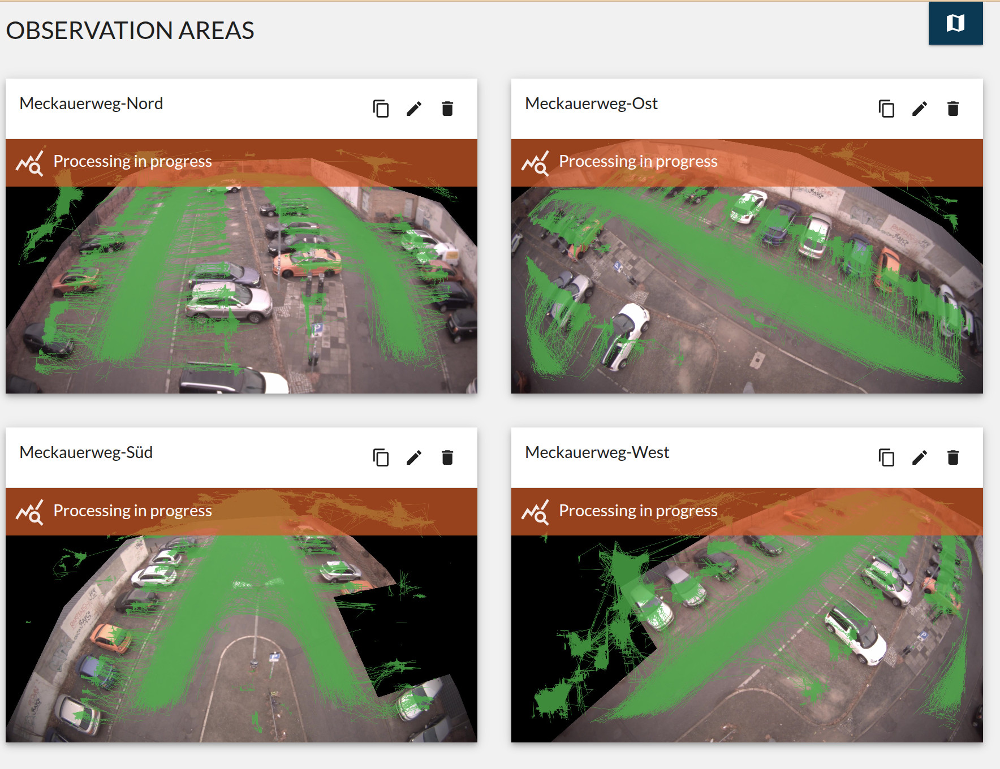
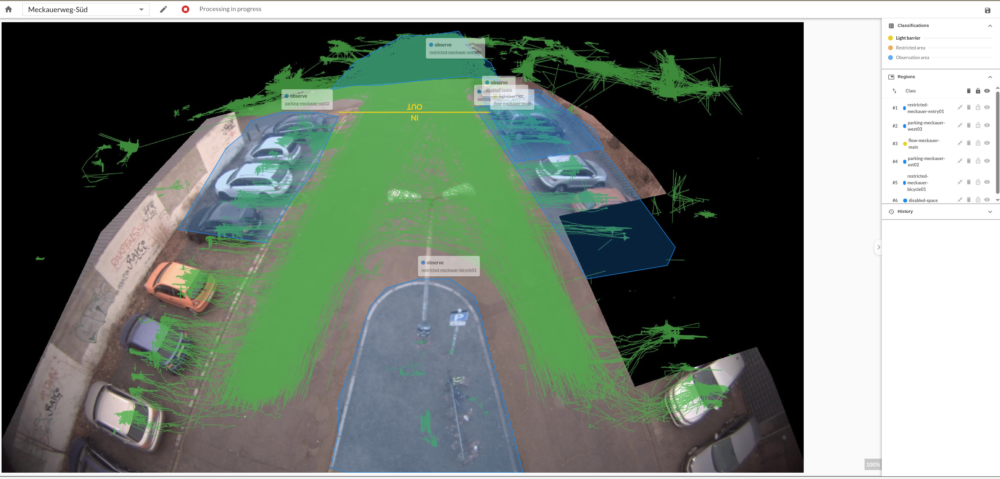

# Introduction

This repository contains an application that allows you to define areas to observe present objects and thresholds to count objects moving across. It is open source under the AGPL license and other usages are recommended. For more details on licensing see section [License](#license).

## What does it do?

This software provides graphical tools to manage parking spaces. Users can define various area types that creates a configuration for a parking space which will then converted into AI based counting and monitoring jobs.

Following screenshot shows an example instances with four running configurations:

An individual configuration can contain many items, to count objects or collect movement data. Next screenshot shows an example configuration:

# Installation

This application runs on Kubernetes and standard installation tool is Helm. See section [Development](#development-setup) for other ways to run software in an dev environment.

## Deployment with Helm

Helm is a templating engine, that generates Kubernetes config files. It can be used to install, upgrade or delete apps on Kubernetes.

All artifacts for this application are released to [Docker Hub](https://hub.docker.com/r/starwitorg/observatory-config). All necessary components can be deployed using Helmfile. Instructions and examples can be found in this [repository](https://github.com/starwit/observatory-deployment).

### Custom Values File

For target environment some configuration is necessary. In Helm you can provide config data via a custom value file. See the template [value file](deployment/helm/observatory-config/values-local-tpl.yaml) for an example. More detailed explanation for individual fields are provided in the [Readme](deployment/helm/observatory-config/Readme.md) file.

# Development & Architecture

Developer instructions can be found in [dev docs](docs/Readme-dev.md). This repository is part of an application and the following picture shows components to run observatory.

# License

Code in this repository is property of [Starwit Technologies GmbH](https://starwit-technologies.de/) and is published under AGPLv3. So if you want to adapt it, any change needs to be published under AGPLv3 as well. Please let us know, which changes you made. Same goes for errors and bugs. License can be found at [here](License).
